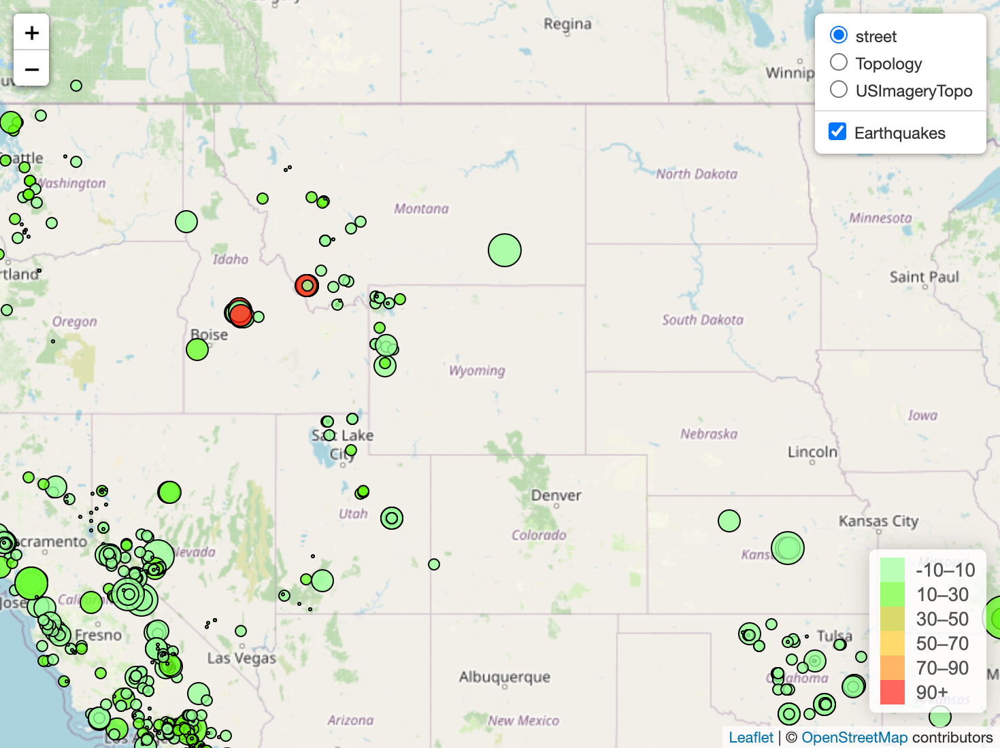
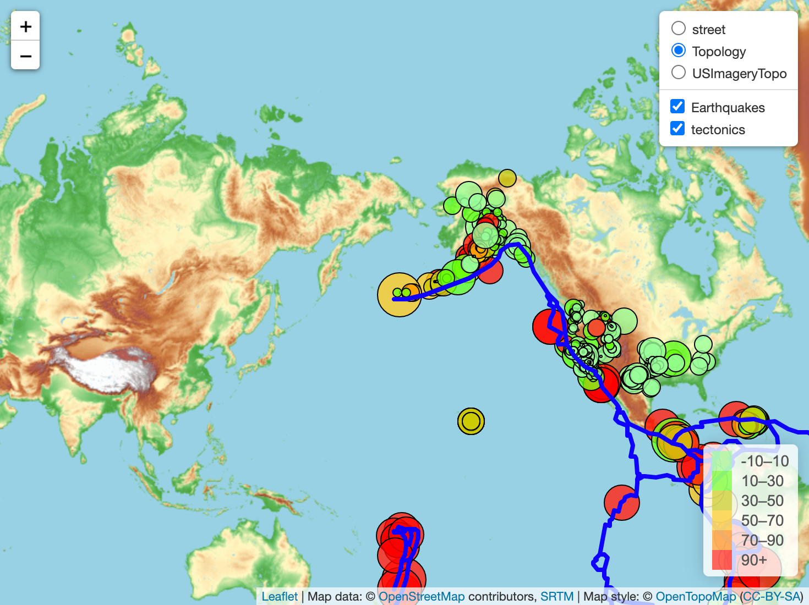

# leaflet_challenge
leaflet js homework
### Level-1
#### Import & Visualize the Data
* Create a map using Leaflet that plots all of the earthquakes from your data set based on their longitude and latitude.
* Your data markers should reflect the magnitude of the earthquake by their size and and depth of the earthquake by color. 
* Earthquakes with higher magnitudes should appear larger and earthquakes with greater depth should appear darker in color.
* * HINT: The depth of the earth can be found as the third coordinate for each earthquake.
* Include popups that provide additional information about the earthquake when a marker is clicked.
* Create a legend that will provide context for your map data.

#### The USGS wants you to plot a second data set on your map to illustrate the relationship between tectonic plates and seismic activity. You will need to pull in a second data set and visualize it alongside your original set of data. Data on tectonic plates can be found at https://github.com/fraxen/tectonicplates.

#### In this step, you will:
* Plot a second data set on our map.
* Add a number of base maps to choose from as well as separate out our two different data sets into overlays that can be turned on and off independently.
* Add layer controls to our map.

